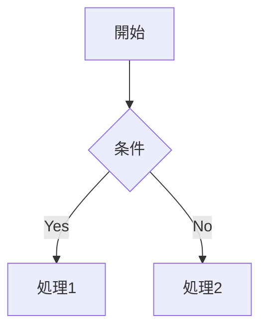

# ClipShip

クリップボードの内容を各種ホスティングサービスにワンクリックでデプロイする Chrome 拡張機能です。

## 機能

- **1クリックデプロイ**: Options でデフォルトプロバイダーを設定し、ワンクリックでデプロイ
- **コンテンツタイプの自動検出**: HTML、Markdown、プレーンテキストを自動判定
- **Markdown レンダリング**: markdown-it によるレンダリング
- **シンタックスハイライト**: highlight.js による 20 以上の言語のコードハイライト
- **数式レンダリング**: KaTeX による LaTeX 数式のサポート（`$...$`, `$$...$$`）
- **タスクリスト**: GitHub 形式のチェックボックス（`- [ ]`, `- [x]`）
- **脚注**: 学術文書向けの脚注記法（`[^1]`）
- **Emoji**: ショートコードによる絵文字変換（`:smile:` → 😄）
- **取り消し線**: `~~text~~` 記法のサポート
- **Mermaid ダイアグラム**: Mermaid 記法によるフローチャート、シーケンス図などの描画
- **4 つのデプロイ先**:
  - **Netlify**: 独自ドメインでホスティング（File Digest API で増分デプロイ）
  - **Vercel**: 高速な Edge ネットワークでホスティング
  - **Cloudflare Pages**: グローバル CDN でホスティング
  - **GitHub Gist**: GistHack 経由で HTML プレビュー
- **XSS 対策**: Markdown 内の HTML タグを無効化

## インストール

### 開発環境

```bash
# 依存関係のインストール
bun install

# 開発ビルド（ウォッチモード）
bun run dev

# プロダクションビルド
bun run build
```

### Chrome への読み込み

1. Chrome で `chrome://extensions` を開く
2. 「デベロッパーモード」を有効化
3. 「パッケージ化されていない拡張機能を読み込む」をクリック
4. `dist` フォルダを選択

## 使い方

### 初期設定

1. 拡張機能のアイコンを右クリック → 「オプション」
2. デフォルトのデプロイ先を選択（Netlify / Vercel / Cloudflare Pages / GitHub Gist）
3. 選択したサービスの API トークンを設定:
   - **Netlify**: [Personal Access Token](https://app.netlify.com/user/applications#personal-access-tokens) を取得
   - **Vercel**: [Personal Access Token](https://vercel.com/account/tokens) を取得
   - **Cloudflare Pages**: [API Token](https://dash.cloudflare.com/profile/api-tokens) と Account ID を取得
   - **GitHub Gist**: `gist` スコープを持つ [Personal Access Token](https://github.com/settings/tokens) を取得

### デプロイ

1. デプロイしたい HTML / Markdown / テキストをクリップボードにコピー
2. 拡張機能のアイコンをクリック
3. 「Deploy to [プロバイダー名]」ボタンをクリック（デフォルトプロバイダーが表示されます）
4. デプロイ完了後、新しいタブで URL が開き、クリップボードにも URL がコピーされます

## サポートするコンテンツ

### HTML

```html
<!DOCTYPE html>
<html>
<head><title>Example</title></head>
<body><h1>Hello World</h1></body>
</html>
```

HTML フラグメント（`<div>`, `<p>` など）もサポートしています。

### Markdown

見出し、リスト、コードブロック、リンク、画像、テーブルなどの標準的な Markdown 記法をサポートしています。

````markdown
# 見出し

- リスト項目
- リスト項目

```javascript
console.log('Hello, World!');
```
````

### シンタックスハイライト対応言語

JavaScript, TypeScript, Python, Java, SQL, Bash, JSON, YAML, XML, CSS, Markdown, Go, Rust, Ruby, PHP, C, C++, C#, Kotlin, Swift, Dockerfile

### Mermaid ダイアグラム

````markdown

````

サポートするダイアグラム: flowchart, sequenceDiagram, classDiagram, stateDiagram, erDiagram, gantt, pie, gitGraph, mindmap, timeline, quadrantChart, xychart, sankey

### 数式 (KaTeX)

インライン数式と表示数式をサポートしています。

```markdown
インライン数式: $E = mc^2$

表示数式:
$$
\sum_{i=1}^{n} x_i = x_1 + x_2 + \cdots + x_n
$$
```

### タスクリスト

GitHub 形式のタスクリストをサポートしています。

```markdown
- [x] 完了したタスク
- [ ] 未完了のタスク
- [ ] 別のタスク
```

### 脚注

学術文書向けの脚注記法をサポートしています。

```markdown
本文のテキスト[^1]と続きます。

[^1]: これは脚注の内容です。
```

### Emoji

ショートコードで絵文字を挿入できます。

```markdown
:smile: :heart: :thumbsup: :rocket:
```

→ 😄 ❤️ 👍 🚀

### 取り消し線

```markdown
~~取り消された文字~~
```

## 技術スタック

- **ビルドツール**: Bun
- **言語**: TypeScript
- **Markdown レンダリング**: markdown-it
- **シンタックスハイライト**: highlight.js (CDN)
- **数式**: KaTeX (CDN)
- **ダイアグラム**: Mermaid.js (CDN)
- **API クライアント**: ky
- **バリデーション**: zod
- **ID 生成**: nanoid
- **リンター**: Biome
- **テスト**: Bun Test, Playwright

## 開発

```bash
# リント
bun run lint

# フォーマット
bun run format

# テスト
bun run test

# E2E テスト
bun run test:e2e

# パッケージング
bun run package
```

## 画像アセット生成

Chrome Web Store 用の画像アセット（アイコン、スクリーンショット、プロモーション画像）は Gemini API で生成できます。

```bash
# 依存関係インストール
pip install python-dotenv requests pillow

# .env ファイルに GEMINI_API_KEY を設定
echo "GEMINI_API_KEY=your-api-key" > .env

# 全画像を生成
python3 scripts/generate_assets.py

# 特定の画像のみ生成
python3 scripts/generate_assets.py -t icon

# モデルを指定
python3 scripts/generate_assets.py -m gemini-2.5-flash
```

生成されるファイル:
- `public/icon{16,32,48,128}.png` - 拡張機能アイコン
- `assets/promo_small_440x280.png` - 小プロモーションタイル
- `assets/promo_large_920x680.png` - 大プロモーションタイル
- `assets/screenshot_*.png` - スクリーンショット

## Chrome Web Store 公開

`docs/chrome-web-store.md` に公開用のドキュメントがあります:
- ストア説明文
- 権限の正当化
- 画像アセット一覧

プライバシーポリシーは `docs/privacy-policy.md` を参照してください。

## ライセンス

MIT
